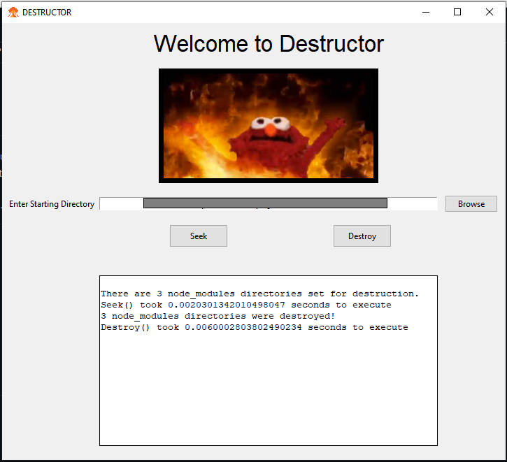

# DESTRUCTOR

## Description

Tired of node_modules bloat but have too many projects locally? Need to seek them out and DESTROY them? Look no further, Destructor is here!

## Table of Contents
- [Installation](#Installation)
- [Usage](#Usage)
- [Contributing](#Contributing)
- [Testing](#Testing)
- [Questions](#Questions)
- [License](#License)

## Installation

Clone repo.

## Usage

- Browse to starting directory where you would like the app to start its search.
- After starting directory is selected, click "Seek".
- The dialogue box will then display how many node_modules directories have been found and report function execution time.
- You are now ready to deal destruction! Click "Destroy" and watch as the app destroys all node_modules directories it can find in the selected path!
- The dialogue box will display how many node_modules directories have been destroyed and report function execution time.

## Contributing
### How to Contribute:

Clone and submit a PR, but please coordinate first.

## Testing

None.

## Questions

Here's my [GitHub Profile](https://github.com/DA-Mike/).
If you have any questions, please feel free to contact us at mike.rugh@gmail.com.

## License

This project is covered under [MIT](https://choosealicense.com/licenses/mit/).

Generated by Readme-Automaton
